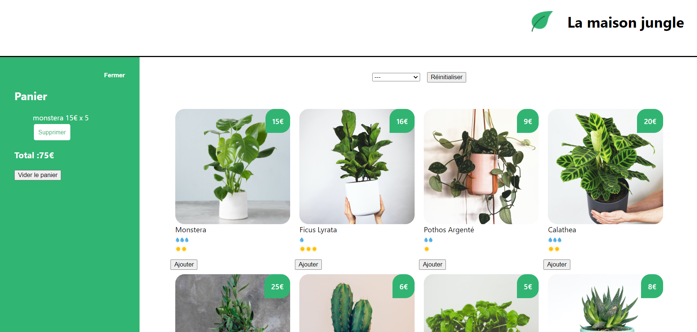

# La maison Jungle : Application de vente de plantes avec Creat React App

## Premiers pas avec l'application Create React

Ce projet a été démarré avec [Create React App](https://create-react-app.dev/).

### Scénarios disponibles

Dans le répertoire du projet, vous pouvez exécuter :

#### `yarn start`

Exécute l'application en mode développement.
Ouvrez [http://localhost:3000](http://localhost:3000) pour l'afficher dans votre navigateur.

La page se rechargera lorsque vous apporterez des modifications.
Vous pouvez également voir des erreurs de charpie dans la console.

#### `yarn test`

Lance le testeur en mode montre interactive.

Voir la section sur [l'exécution des tests](https://facebook.github.io/create-react-app/docs/running-tests) pour plus d'informations.

#### `yarn build`

Génère l'application pour la production dans le  dossier `build`.
Il regroupe correctement React en mode production et optimise la construction pour les meilleures performances.

La construction est minifiée et les noms de fichiers incluent les hachages.
Votre application est prête à être déployée !.
Your app is ready to be deployed!

Voir la section sur le [déploiement](https://facebook.github.io/create-react-app/docs/deployment) pour plus d'informations.

#### `yarn eject`

**Remarque : il s'agit d'une opération à sens unique. Une fois que vous `eject`, vous ne pouvez pas revenir en arrière!**

Si vous n'êtes pas satisfait de l'outil de construction et des choix de configuration, vous pouvez le faire `eject` à tout moment. Cette commande supprimera la dépendance de construction unique de votre projet.

Au lieu de cela, il copiera tous les fichiers de configuration et les dépendances transitives (webpack, Babel, ESLint, etc.) directement dans votre projet afin que vous ayez un contrôle total sur eux. Toutes les commandes sauf `eject` fonctionneront toujours, mais elles pointeront vers les scripts copiés afin que vous puissiez les modifier. À ce stade, vous êtes seul.

Vous n'avez jamais besoin d'utiliser `eject`. L'ensemble de fonctionnalités organisé convient aux déploiements de petite et moyenne taille, et vous ne devriez pas vous sentir obligé d'utiliser cette fonctionnalité. Cependant, nous comprenons que cet outil ne serait pas utile si vous ne pouviez pas le personnaliser lorsque vous êtes prêt.

## Comment participer au projet ?

  1. Cloner le projet 
      
         git clone https://github.com/MaryamVerdon/la-maison-jungle.git
        
    
  2. En ligne de commande, se placer dans le répertoire `la-maison-jungle`
  
    
         cd la-maison-jungle
        
         yarn install
        
         yarn start
        
 ## Le projet
 
 Comme décrit ci-dessus, ce projet est une application de vente de plante. 
 
 ### Fonctionnalités du projet
 
  - Affichage des plantes , de leur prix et de leurs besoins.
  - Tri des plantes par catégories.
  - Gestion d'un panier (ajout/supression de plantes), mise à jour du solde ect
  - Vider le panier
 
 
 
 La réalisation de se projet permet de :
 
  - prendre en mains `Create React App`.
  - se familiariser avec les principes de base du `JSX` entre affichage conditionnel et création de listes de `composants`, `props` et `événements`.
  - se familiariser avec l'utilisation des `state` et de `useEffect`.
 
Ce projet a été réalisé en suivant le cours `Débuter avec React` sur [openclassrooms](https://openclassrooms.com/fr/courses/7008001-debutez-avec-react/7137561-tirez-le-maximum-de-ce-cours).
 
